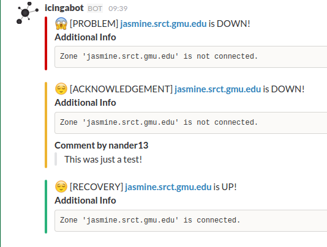

# Icinga2 Slack poster

A small bash script that will accept messages from Icinga2 and push them to a Slack webhook.

## Icinga config
This is pretty much a drop-in replacement for the usual mail-host-notification.sh and mail-service-notification.sh files. 

    object NotificationCommand "mail-host-notification" {
      import "plugin-notification-command"
    
      command = [ SysconfDir + "/icinga2/scripts/slack-host-notification.sh" ]
    
      env = {
        NOTIFICATIONTYPE = "$notification.type$"
        HOSTALIAS = "$host.display_name$"
        HOSTADDRESS = "$address$"
        HOSTSTATE = "$host.state$"
        LONGDATETIME = "$icinga.long_date_time$"
        HOSTOUTPUT = "$host.output$"
        NOTIFICATIONAUTHORNAME = "$notification.author$"
        NOTIFICATIONCOMMENT = "$notification.comment$"
        HOSTDISPLAYNAME = "$host.display_name$"
        USEREMAIL = "$user.email$"
      }
    }

    object NotificationCommand "mail-service-notification" {
      import "plugin-notification-command"
    
      command = [ SysconfDir + "/icinga2/scripts/slack-service-notification.sh" ]
    
      env = {
        NOTIFICATIONTYPE = "$notification.type$"
        SERVICEDESC = "$service.name$"
        HOSTALIAS = "$host.display_name$"
        HOSTADDRESS = "$address$"
        SERVICESTATE = "$service.state$"
        LONGDATETIME = "$icinga.long_date_time$"
        SERVICEOUTPUT = "$service.output$"
        NOTIFICATIONAUTHORNAME = "$notification.author$"
        NOTIFICATIONCOMMENT = "$notification.comment$"
        HOSTDISPLAYNAME = "$host.display_name$"
        SERVICEDISPLAYNAME = "$service.display_name$"
        USEREMAIL = "$user.email$"
      }
    }

## Script config
The only real configuration essential is the slack hook URL at the very tail of the files. Past that, feel free to change anything you want, and open a pull request if you do something cool with it!
